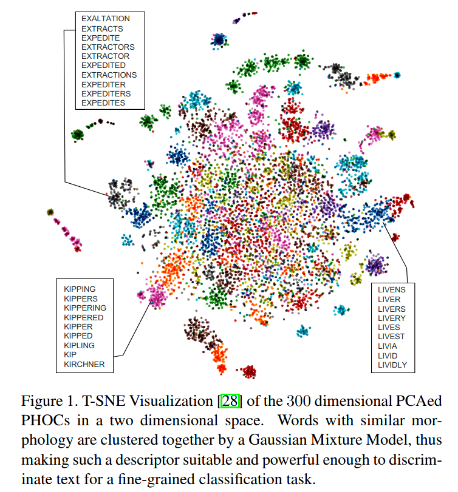

# Fine-grained classification with textual cues

Implementation based in our paper: https://arxiv.org/pdf/2001.04732.pdf

## Install

Create Conda environment

    $ conda env create -f environment.yml

Activate the environment

    $ conda activate finegrained

Train from scratch

python3 train.py 

(Please refer to the code to decide the args to train the model)

## Datasets

Con-Text dataset can be downloaded from:
https://staff.fnwi.uva.nl/s.karaoglu/datasetWeb/Dataset.html

Drink-Bottle dataset:
https://drive.google.com/open?id=1ss9Pxr7rsdCpYX7uKjd-_1R4qCpUYTWT

## Textual Features

The results depicted in the paper were obtained by using the Fisher Vector of a set of PHOCs obtained from an image.
To extract the PHOCs, the following to repos can be used:

 https://github.com/DreadPiratePsyopus/Pytorch-yolo-phoc (Pytorch)
 https://github.com/lluisgomez/single-shot-str (Tensorflow)
 
Finally, the Fisher Vector out of the obtained PHOCs are used during training/inference time.

The Fisher Vector implementation was taken from:
https://gist.github.com/danoneata/9927923

In the folder 'preproc' there is a script which does the following:
1) Create a PHOC dictionary.
2) Perform Scaling, Normalization, PCA of the PHOC dictionary.
3) Train a GMM based on the PHOC data (Takes aprox. 6000 seconds)
4) Given a PHOC result path with .txt files as PHOC predictions, reads each file and constructs the Fisher Vector to be used to train the model.

Simply edit the path that contains the PHOC predictions and the path to save  the Fisher Vectors. This path is the one that the Dataloader uses to load the textual features at training/inference time.
Finally, run:

    $ python2 phocs_to_FV.py
    
I can provide the Textual Features for the Bottles and Context dataset used in the paper, but if you want to train/test the model with another dataset you will have to generate the Textual features.

## Classification Results

